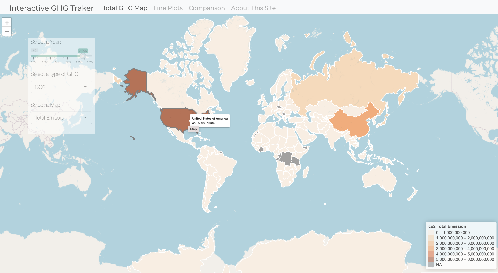

## GreenhouseGas interactive Visualization

This repo contains the code for R Shiny App to visulize greenhouse gas emission data from [Our World in Data](https://github.com/owid/co2-data). Visulizations of the data include interactive maps, line plots and bar plots.

## Demo

Follow [this](https://austinyxm.shinyapps.io/GHG-Traker/) link for the interactive Shiny app. A screenshot of the interface is provided below.

## Authors

[Xinmiao Yu](https://github.com/austinyu), [Luoyu Zhang](https://github.com/Luoyu826), [Chengxin Liu](https://github.com/TML17)

## References 

HTML and CSS Style files are adapted from [COVID-19 interactive mapping tool.](https://github.com/eparker12/nCoV_tracker) 

Dataset by [Our World in Data.](https://github.com/owid/co2-data) 

